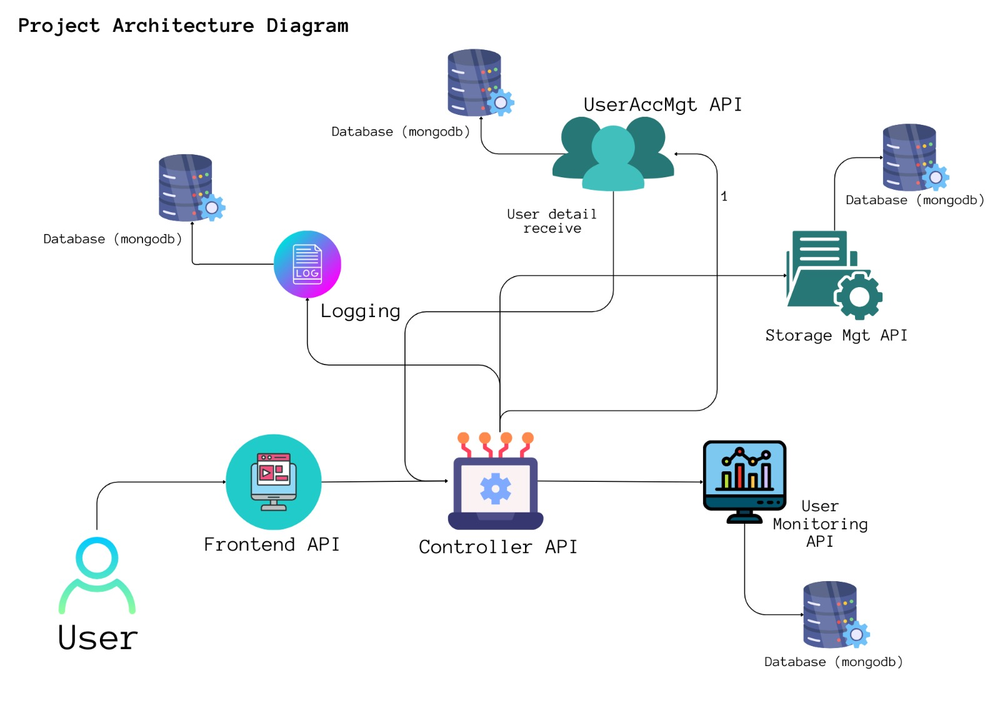

# CloudSnap - Next Gen Photo Gallery

## Project Overview:

CloudSnap is a cutting-edge cloud-centric photo gallery application designed to harness the power of microservices architecture. Leveraging Google Cloud Platform (GCP) as a Platform as a Service (PaaS), CloudSnap deploys multiple microservices to achieve seamless photo management, storage, user accounts, usage monitoring, and a scalable architecture to meet the modern demands of web-based applications.

## Microservices Architecture:

1. **FrontendServ:**
   - Responsible for user interface and interaction.
   - Developed using HTML, CSS, and client-side libraries.
   - Communicates with the Controller microservice.

2. **UserAccMgmtServ:**
   - Manages user accounts and identity.
   - Utilizes a relational database or NoSQL as per choice.
   - Exposes APIs for user-related functionalities.
   - Independent of other microservices.

3. **StorageMgmtServ:**
   - Allocates 10MB cloud storage to each user.
   - Monitors storage usage and alerts users at 80% usage.
   - Prevents further uploads at 100% usage.
   - Independent of other microservices.

4. **UsageMntrServ:**
   - Monitors user activity in terms of data volume.
   - Sends email alerts when users exceed a specified daily limit (e.g., 25MB).
   - Independent of other microservices.

5. **ControllerServ:**
   - Orchestrates communication between microservices.
   - Manages the flow of requests and responses.
   - Ensures seamless integration of all microservices.

## Key Features:

1. **User Accounts Management:**
   - Securely handles user registration, login, and identity management.
   - Provides APIs for user-related actions.

2. **Storage Management:**
   - Allocates and monitors cloud storage for each user.
   - Sends alerts and restricts uploads based on storage usage.

3. **Usage Monitoring:**
   - Monitors user activity in terms of data volume.
   - Alerts users when exceeding specific usage limits.

4. **Frontend View:**
   - Renders an appealing UI for users to browse and interact with photos.

5. **Controller Microservice:**
   - Orchestrates communication between various microservices.
   - Ensures smooth interactions and data flow.

## Load Testing:

- Conducted load testing to determine concurrent user capacity.
- Utilized automated testing tools to simulate user traffic.
- Monitored load at specific times and generated graphs for analysis.

## Logging:

- Implemented a logging mechanism for monitoring user activities.
- Maintains general log files for user interactions and system activities.

## Working Github URLs:

| Name                   | Repo                                                  |
|------------------------|-------------------------------------------------------|
| Syed Ahsan Ullah Tanweer | [usage-monitoring-microservice](https://github.com/Me-AU/usage-monitoring-microservice) |
| Hussain Mehdi Kazmi      | [FrontendMicroServ](https://github.com/Mr-H-Mehdi/FrontendMicroServ) |
| Shumail Qaiser           | [front-back-service](https://github.com/Shumailseecs21/front-back-service) |
| Nida Naveed              | [StorageManagementService](https://github.com/Nida-Naveed/StorageManagementService.git) |
| Navaira Rehman           | [UserAccMgmtServ](https://github.com/NavairaRehman/UserAccMgmtServ) |

## Conclusion:

CloudSnap demonstrates the power of microservices architecture, providing a robust, scalable, and efficient solution for cloud-based photo gallery applications. The seamless integration of microservices ensures independent deployability and enhances the overall performance and user experience.
